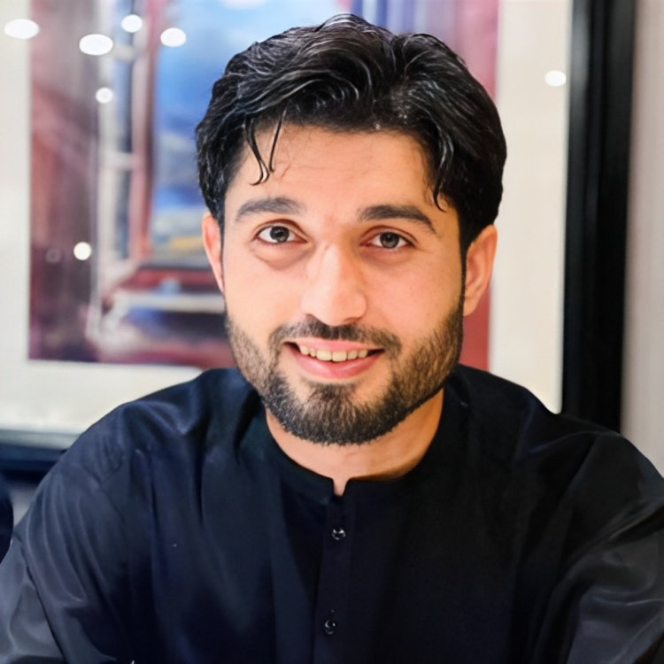

A community-maintained open-source project aimed at making personal portfolio for researchers, developers and analysts simple, fast and less cumbersome. We make sure you have a full-fledged website to showcase your work while you can spend time on your learning and innovative endeavors.

## A sneak peek into what we have here🙈

# A sneak peek into what we have here🙈 :

### Home Page:

### Experience Page:

### Project Page:

### Research Page:

### Education Page:

## Project Maintainers👨🏫:

|  | 
| :----------------------------------------------------------: | 
| [Ali Nawaz](https://github.com/Aliktk)               |   

